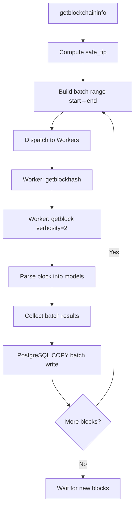

# Architecture

> Understanding the Bitcoin Indexer pipeline: how blocks flow from Bitcoin Core RPC into PostgreSQL.

---

## Overview

Bitcoin Indexer is built around a single principle: **avoid row-by-row processing at every layer**. Blocks are fetched concurrently, parsed in memory, and written to PostgreSQL in batch COPY operations. Nothing touches the database one row at a time.

The system has three main stages: **Fetch**, **Parse**, and **Write**.

---

## Full System Diagram

```
┌────────────────────────────────────────────────────────────────────┐
│                         Bitcoin Indexer                            │
│                                                                    │
│  ┌─────────────────┐        ┌──────────────────────────────────┐  │
│  │  Bitcoin Core   │        │         Pipeline Workers         │  │
│  │                 │        │                                  │  │
│  │  getblockhash   │──RPC──▶│  ┌─────────────┐ ┌───────────┐  │  │
│  │  getblock (v2)  │        │  │  Worker 1   │ │ Worker 2  │  │  │
│  │  getblockchain  │        │  │  fetch+parse│ │fetch+parse│  │  │
│  │      info       │        │  └──────┬──────┘ └─────┬─────┘  │  │
│  └─────────────────┘        │         └───────┬───────┘        │  │
│                              │                 ▼                │  │
│                              │      ┌─────────────────┐        │  │
│                              │      │   Batch Writer  │        │  │
│                              │      │  (pgx COPY ops) │        │  │
│                              └──────┴────────┬────────┴────────┘  │
│                                              │                    │
│              ┌───────────────────────────────▼──────────────────┐ │
│              │                  PostgreSQL 16                   │ │
│              │                                                  │ │
│              │   blocks            transactions                 │ │
│              │   tx_inputs         tx_outputs                   │ │
│              │   address_transactions                           │ │
│              │   utxo_set          address_balances             │ │
│              └──────────────────────┬───────────────────────────┘ │
│                                     │                             │
│              ┌──────────────────────┤                             │
│              │                      │                             │
│   ┌──────────▼──────────┐  ┌────────▼───────────────┐            │
│   │      HTTP API       │  │  Apache AGE             │            │
│   │  Address queries    │  │  Graph traversal        │            │
│   │  TX lookups         │  │  Transaction tracing    │            │
│   │  UTXO queries       │  │  Cluster analysis       │            │
│   └─────────────────────┘  └────────────────────────┘            │
└────────────────────────────────────────────────────────────────────┘
```

---

## Pipeline Flow



---

## Stage 1: Fetch

Each worker independently fetches a block using two sequential RPC calls:

1. `getblockhash(height)` → returns the block hash for a given height
2. `getblock(hash, verbosity=2)` → returns full block with decoded transactions

Workers run concurrently. The batch does not advance until **all workers in the batch finish** — the wall time equals the slowest worker.

```
Batch [141035, 141036]
  Worker 1: getblockhash(141035) → getblock(...) → done in 45ms
  Worker 2: getblockhash(141036) → getblock(...) → done in 671ms
  Batch wall time = 671ms  ← slowest worker
```

During Bitcoin Core IBD, `getblockhash` is the most frequent bottleneck. It can spike to 3–10 seconds while Bitcoin Core is busy with LevelDB compaction or block validation. `getblock` itself is almost always fast once the hash is known.

---

## Stage 2: Parse

The parser converts raw Bitcoin Core JSON into Go structs and then into database rows:

```
Raw JSON block
    │
    ├── Block header   →  blocks row
    ├── Transactions   →  transactions rows
    │     ├── Inputs   →  tx_inputs rows
    │     └── Outputs  →  tx_outputs rows
    │           └── Addresses → address_transactions rows
    │                         → utxo_set rows
    └── Balance deltas → address_balances rows
```

Parse time is typically **microseconds to low milliseconds** even for blocks with thousands of transactions. If you see `parse=2s` in logs, investigate Go CPU usage and JSON decode overhead.

---

## Stage 3: Write

The batch writer collects all parsed rows from every worker in the batch and writes them to PostgreSQL in a single COPY operation per table. This avoids:

- per-row insert overhead
- index maintenance on each row
- excessive WAL writes

```
Batch of 2 blocks → single COPY into:
  blocks           (2 rows)
  transactions     (100–5000 rows)
  tx_inputs        (100–15000 rows)
  tx_outputs       (100–15000 rows)
  address_transactions (200–30000 rows)
  utxo_set         (delta rows)
  address_balances (delta rows)
```

DB write time is typically **15–100ms** for early blocks. For recent high-transaction blocks it can reach 500ms+, which is expected.

---

## Safe Tip Tracking

The indexer never indexes right up to the current chain tip. It maintains a **confirmation window** — a fixed number of blocks behind the node tip — to avoid indexing blocks that may be reorganized.

```
Node tip:     886,457
Safe tip:     886,447   ← indexer stops here (10-block window)
Indexer at:   141,054
```

The safe tip is recomputed on every poll of `getblockchaininfo`.

---

## Concurrency Model

```
Main goroutine
    │
    ├── Spawns N workers (N = workers config)
    │     ├── Worker goroutine 1
    │     ├── Worker goroutine 2
    │     └── ...
    │
    ├── Waits for all workers in batch (WaitGroup)
    │
    └── Calls batch writer (single goroutine, sequential)
```

Worker count should equal batch size during IBD. Extra workers sit idle and add RPC pressure to a node that is already busy.

---

## Apache AGE Graph Layer

Apache AGE runs inside PostgreSQL 16 and models Bitcoin transaction relationships as a property graph:

- **Nodes**: addresses, transactions
- **Edges**: inputs (address → transaction), outputs (transaction → address)

This enables traversal queries like "find all addresses connected to this transaction within 3 hops" using Cypher syntax directly inside PostgreSQL.

---

## Repository Internals

| Package | Responsibility |
|---|---|
| `cmd/indexer` | Entry point, starts pipeline loop |
| `cmd/api` | Starts HTTP API server |
| `cmd/backfill` | Repair and historical reprocessing |
| `internal/pipeline` | Fetch, parse, and ingest coordination |
| `internal/db` | Batch writer, partition management |
| `internal/api` | HTTP handlers and repository queries |
| `internal/config` | YAML + environment config loading |
| `internal/models` | Shared domain structs |
| `pkg/rpc` | Bitcoin Core JSON-RPC client |

---

## Related Pages

- [Installation](installation.md) — set up the full stack
- [Configuration](configuration.md) — tune workers, batch size, RPC
- [Performance](performance.md) — benchmarks and optimization
- [Schema](schema.md) — database tables and partitioning
